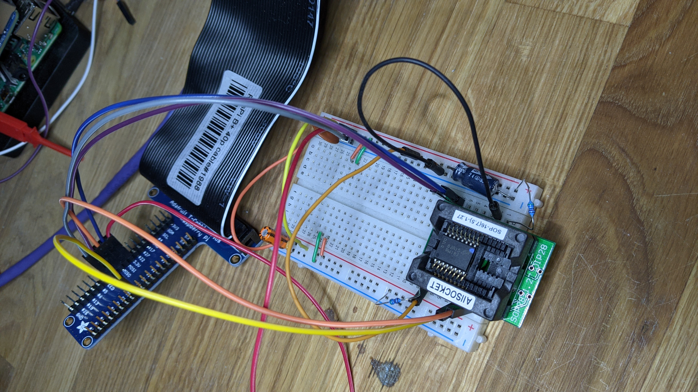

# spi0
Very simple SPI device programmer based on Raspberry Pi.


# Installation
I used Raspbian and also Ubuntu Server 20.04 to try this out on a
Raspberry Pi 0W (Raspbian) and on a Raspberry Pi 4B (Ubuntu Server
20.04.2).

On Ubuntu I needed to add a `spi` group so I could access the devices
without sudo while logged in as username `ubuntu`.

```
    sudo addgroup spi
    sudo adduser ubuntu spi
    sudo echo 'SUBSYSTEM=="spidev", GROUP="spi", MODE="0660"' | \
         tee /etc/udev/rules.d/99-spidev-group-spi.rules
    sudo udevadm control --reload-rules
    sudo udevadm trigger -s spidev
    newgrp spi
```

Install lua, its runtime library for building the SPIOPS C extension,
and the C program building tools.

```
    sudo apt install lua5.3 lib5.3-dev build-essential
```

Clone this respository and cd into the directory and type `make` to
build the C extension library. I also included a `chmod` command and a
symbolic link creation in the Makefile to be sure the protection on
the Lua script allows execution for ease of command line use.


# Wiring
Attach your device to the Raspberry Pi's SPI #0 bus. The [Raspberry Pi
pinout page](https://pinout.xyz) may be useful for figuring this out.
In the table below I show the Raspberry Pi pin number and the pin
number from the SO-16 package of the Micron MT25QL512ABB8ESF-0SIT 64MB
flash chip I used with this program to test. The pins need to be
connected like so:

| Signal Name | Raspberry Pi Pin | Typical Chip Pin |
| :---: | :---: | :---: |
| 3.3V | 3v3 Power (17) | Vcc (2) |
| MOSI | SPI0 MOSI (19) | DQ0 (15) |
| MISO | SPI0 MISO (21) | DQ1 (8) |
| CLK | SPI0 SCLK (23) | C (16) |
| CE# | SPI0 CE0 (24) | S# (7) |
| GND | Ground (25)  | Vss or GND (10) |
| ~5K pullup to Vcc | none | HOLD# (1) |
| ~5K pullup to Vcc | none | RESET# (3) |
| ~5K pullup to Vcc | none | W# (9) |

I used an "ALLSOCKET SOP16-7.5-1.27 SOP16 Package SOIC16 SO16 SOP16 to
DIP16 Programming Adapter" ordered from Amazon.com to hold my flash
chip, which is in a SO-16 package and thus rather difficult to connect
on a breadboard or with wire jumpers. I plugged the socket into a
small solderless breadboard to make the connections from the Raspberry
Pi to the chip easily and so I could introduce the pullups and
decoupling capacitors.

A _really_ useful tool is a "chip sucker", or vacuum pen pickup tool.
Small package chips are really hard to pick up without bending or
damaging their pins - especially from a test socket since the chip
needs to be pulled straight up. I used "Jiayouy 2-Piece Vacuum Pen
Pickup Tool Set for IC SMD Precision Component Placement with
Interchangeable Tips and Cups" ordered from Amazon.com. It's not
_wonderful_, but it works fine. Don't depend on the suction to hold
for more than a few seconds. I think this may be caused by roughness
in the top of the chip package, but it might be a leak in the tool.
Anyway, a few seconds is all I need if I'm careful and, well,
_expeditious_ when moving the chip around.

As shown in the photo, I used an [Adafruit Pi T-Cobbler Plus Kit
Breakout for 2x20 Raspberry Pi - A+, B+, Pi 2, Pi 3, Pi 4,
Zero](https://www.adafruit.com/product/1989) to plug into the
Raspberry Pi's 40-pin header, but you could wire directly to the Pi if
you prefer and it would probably have better signal integrity.



Note my solderless breadboard layout includes the pullup resistors (I
used 5.6K I had on hand) and decoupling capacitors (also on hand:
something like 10nF or 100nF and 10uF with at least 6WVDC and beware
polarity) from Vcc to Ground.

With this setup I can use a 25MHz SPI clock without errors.

Put the SPI flash chip into the ALLSOCKET socket when the Raspberry Pi
is powered off. Make _damned sure_ you put pin 1 in the upper left. My
chip had a paint dot on it (probably placed there to signify it had
been through a testing or preprogramming process in a factory
somewhere) on the _opposite_ corner from where the pin 1 dot was
molded into the package and it fooled me. The chip was very hot when I
discovered my mistake and sheepishly corrected it, but fortunately the
chip was still functional despite my n00b blunder.


# Command Line
You can run the tool from the Raspberry Pi's shell command line
assuming you're logged in as `ubuntu` or in some other way have
privileges to access the /dev/spidev0.0 device. I run my Pi headless
and use ssh to connect from my main Linux system, but you do you.

Start out to see if the device is detected.

```
    ./spi /dev/spidev0.0
```

This should print the device's manufacturer, type, and capacity
values, along with a hex dump of the 20-byte CHIP ID area read from
the device. If you get all 00s or all FFs or some other repeating
pattern you're probably not wired properly.

My chip is the only one I decode these values for, so you may have to
make some changes. I hope to get a more complete JEDEC SPDF based
progamming algorithm into this project someday soon. For now, modify
the Lua code for your chip. It's pretty easy to understand.

Once you have a chip that is recognized you can do things to it. The
command line and the usage help is pretty simple. Just use `./spi0`
with nothing else on the command line to see the help. The main point
is that the Linux device pathname must be the first parameter,
followed by optional range specifications and operations to perform on
those ranges in order left-to-right.

There are quite a few examples in the help text that show the main ideas.

```
  To erase the first 64K of the device on /dev/spidev0.0 use
    spi0 /dev/spidev0.0 0..64K erase

  To erase the region from 256K to 256K+64K use
    spi0 /dev/spidev0.0 256K+64K erase

  To erase the entire device use
    spi0 /dev/spidev0.0 all erase
  (or `all` may be left off since it is the default.)

  To erase the region and then write the contents of kernel.img (up to
  6MB in size) to the device starting at 4MB use
    spi0/dev/spidev0.0 4M+6M erase write kernel.img

  To read the first, third, and fifth megabytes of the device and save them to files use
    spi0/dev/spidev0.0 1M+1M read first.img 3M+1M read third.img 5M+1M read fifth.img
```

By the way, the Linux naming convention is `/dev/spidevN.M` where `N`
is the SPI controller number (I only use one on the Raspberry Pi since
the others are not accessible or in use on the board), and `M` is the
chip select number to drive the `SPICS#` signal to select the device
for operations. In my case `/dev/spidev0.0` is for the main (and
likely only) SPI controller on my Raspberry Pi 4B or Raspberry Pi 0W
and to use the `SPI0 CE0` GPIO as the chip select for the chip.

# Conclusion
I used this project to learn Lua and to build a useful tool. It's
_way_ faster than using `flashrom` to do the equivalent operations,
but it is also more limited in that it cannot support basically any
flash device you find lying on the ground somewhere. It _can_ operate
on a portion of the device, which for some reason `flashrom` seems
determined to make impossible or at least very difficult. And did I
mention it's way faster (especially on a Raspberry Pi 4B)?

I strongly urge you to use `sha256sum` or similar to verify the hash
of your data and to use commands that erase, write, and then verify
like

```
    /spi0 /dev/spidev0.0 erase write full.image verify full.image
```

# **IMPORTANT ANNOUNCEMENT**:
This program may be very buggy. I have just gotten it working. It
needs a lot more testing. I would like to hear your results if you try
it.

I'm thinking of ordering a PCB to be built to stick onto the Raspberry
Pi 40-pin connector and host the socket footprint for some number of
devices. I plan to hard-wire it for my chip's pinout, but it would be
simple to change it to match another pinout or a different footprint.
If I get ambitious I might make rev 2.0 programmable so it could host
pretty much ANY 3.3V pinout SPI flash chip.
